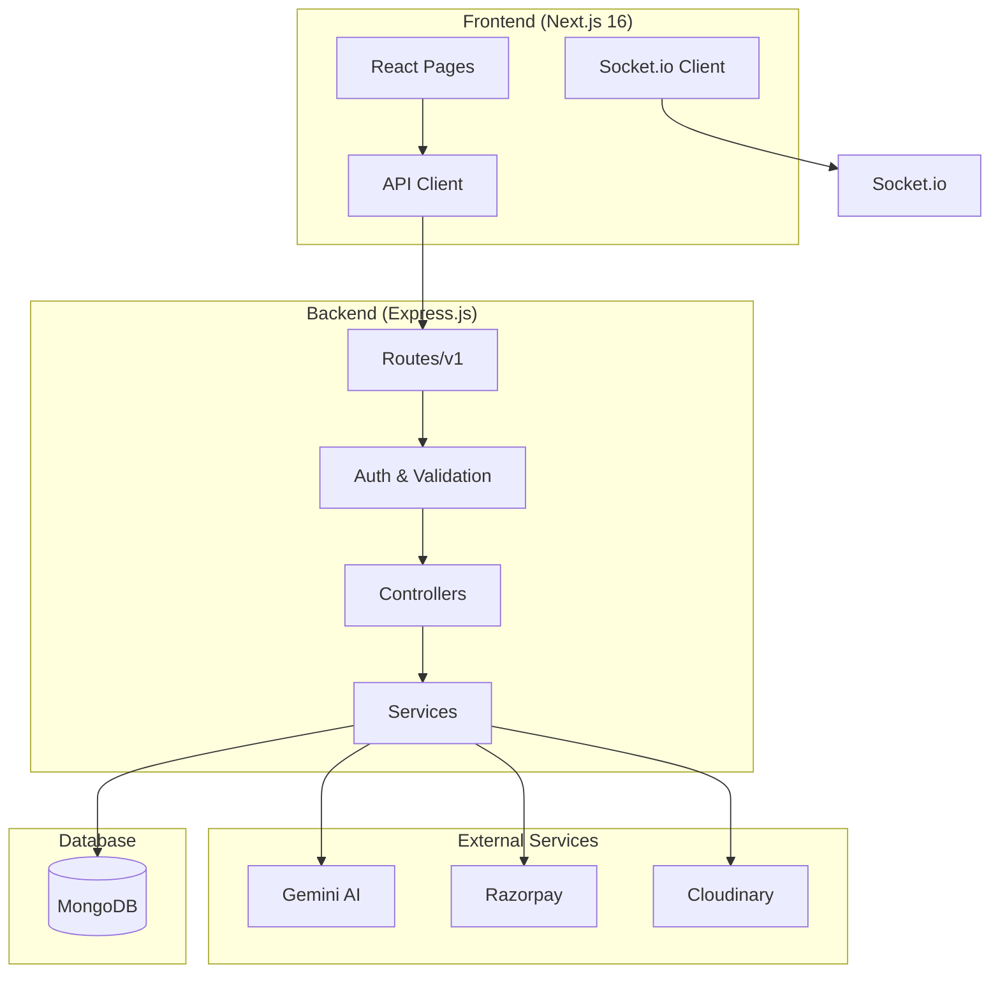
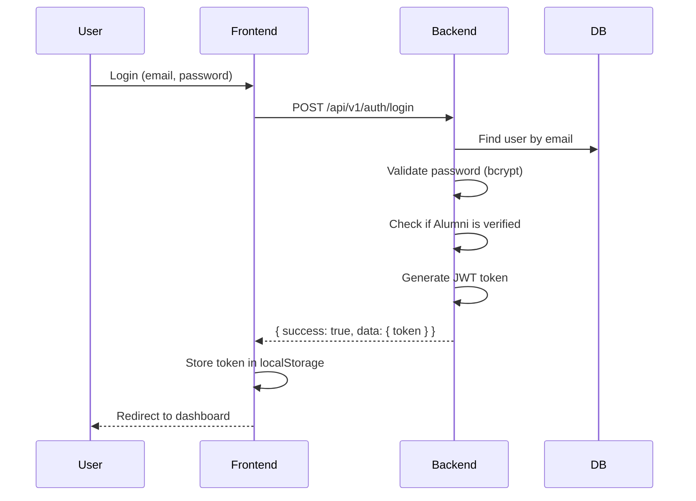

# Sarthak Alumni Management System - Complete Codebase Overview

## Executive Summary

This is a comprehensive **Alumni Management System** built for managing alumni networks for educational institutions. The system supports **multi-tenant architecture** (college isolation), allowing multiple colleges to manage their alumni independently within the same platform.

---

## 📁 Project Structure

```
sih_2025_user/
├── app.js                    # Express server entry point
├── config.js                 # Environment configuration
├── package.json              # Backend dependencies
├── src/
│   ├── controller/           # 21 controllers (business logic)
│   ├── middleware/           # 5 middleware files
│   ├── model/                # 20 Mongoose models
│   ├── routes/               # 22 route files
│   └── service/              # 13 service files
├── utils/
│   ├── db.js                 # MongoDB connection
│   ├── socket.js             # Socket.io real-time
│   ├── logger.js             # Winston logging
│   ├── response.js           # Standardized responses
│   ├── swagger.js            # API documentation
│   └── cloudinary.js         # Image upload
├── scripts/                  # Seed scripts & utilities
└── frontend-alumni/          # Next.js 16 frontend
    ├── app/                  # App router pages
    ├── components/           # Reusable components
    ├── src/api/              # API client & modules
    └── lib/                  # Utilities & providers
```

---

## 🏗️ Architecture Overview



---

## 🗄️ Backend Architecture

### Technology Stack

| Component | Technology | Version |
|-----------|------------|---------|
| Runtime | Node.js | Latest |
| Framework | Express.js | 5.1.0 |
| Database | MongoDB/Mongoose | 9.0.0 |
| Authentication | JWT | 9.0.2 |
| Real-time | Socket.io | 4.8.1 |
| Payment | Razorpay | 2.9.6 |
| AI | Google Gemini | 0.24.1 |
| Image Storage | Cloudinary | 2.8.0 |
| Documentation | Swagger | 6.2.8 |

### Entry Point (`app.js`)

The main server file configures:
- **CORS**: Allows `localhost:3000`, `localhost:3001` and production URLs
- **Security**: Helmet middleware with CSP
- **Rate Limiting**: General API rate limiter
- **API Routes**: All v1 routes mounted at `/api/v1`
- **Socket.io**: Initialized for real-time features
- **Swagger**: API docs at `/api-docs`

```javascript
// Standardized Ports
Backend: http://localhost:5000
Frontend: http://localhost:3001
```

---

## 📊 Data Models (20 Models)

### Core User Models

#### `model.user.js`
```javascript
{
    name: String,
    username: String (unique),
    email: String (required, unique),
    passwordHash: String,
    collegeId: ObjectId → "admins",  // Multi-tenant isolation key
    userType: ["Student", "Alumni", "Admin"],
    profileDetails: ObjectId → refPath: "userType",
    createdAt: Date
}
```

#### `model.alumni.js` (240 lines)
Comprehensive alumni profile with:
- **Basic Info**: userId, verified status, graduationYear
- **Academic**: degree, department, enrollmentNumber, branch
- **Professional**: experience[], currentCompany, designation, industry
- **Education**: education[], timeline[]
- **Social**: linkedIn, github, twitter, portfolio (both nested & flat)
- **Location**: city, state, country, coordinates (for map view)
- **Privacy**: settings for email, phone, location visibility
- **Stats**: profileViews, profileCompletion (0-100)

#### `model.student.js`
```javascript
{
    userId: ObjectId → "User",
    academic: { entryDate, expectedGraduationDate, degreeType, degreeName, currentYear },
    student_id: String,
    skills: [String],
    interests: [String],
    career_goal: String
}
```

### Feature Models

| Model | Purpose | Key Fields |
|-------|---------|------------|
| `model.job.js` | Job postings & applications | title, company, salary, applications[], referrals[] |
| `model.event.js` | Event management | title, date, venue, speakers[], registeredUsers[], tickets[] |
| `model.campaign.js` | Fundraising campaigns | title, targetAmount, donations[], milestones[] |
| `model.donation.js` | Donation tracking | donor, amount, campaign, paymentStatus |
| `model.successStory.js` | Alumni success stories | title, content, author, featured |
| `model.connection.js` | Alumni-Student connections | requester, recipient, status |
| `model.chat.js` | Real-time chat | participants, messages[] |
| `model.notification.js` | Push notifications | userId, type, title, read status |
| `model.alumniCard.js` | Digital alumni card | QR code, validity, benefits |
| `model.survey.js` | Survey forms | questions[], responses |
| `model.newsletter.js` | Email newsletters | subject, recipients, status |
| `model.activity.js` | Activity timeline | type, user, description |
| `model.post.js` | Feed posts | content, author, likes, comments |

---

## 🛣️ API Routes (v1)

### Route Configuration (`src/routes/v1.js`)

All routes are prefixed with `/api/v1`:

| Prefix | Route File | Description |
|--------|-----------|-------------|
| `/auth` | routes.auth.js | Registration, login, verify |
| `/alumni` | routes.alumni.js | Alumni CRUD, profile, AI features |
| `/students` | routes.student.js | Student management |
| `/jobs` | routes.job.js | Job postings & applications |
| `/events` | routes.event.js | Event management |
| `/campaigns` | routes.campaign.js | Fundraising |
| `/donations` | routes.donation.js | Donation processing |
| `/success-stories` | routes.successStory.js | Success stories |
| `/alumni-card` | routes.alumniCard.js | Digital cards |
| `/connections` | routes.connection.js | Networking |
| `/chats` | routes.chat.js | Chat management |
| `/messages` | routes.message.js | Messages |
| `/posts` | routes.post.js | Feed posts |
| `/notifications` | routes.notification.js | Notifications |
| `/activities` | routes.activity.js | Activity feed |
| `/surveys` | routes.survey.js | Surveys |
| `/newsletters` | routes.newsletter.js | Newsletters |
| `/github` | routes.github.js | GitHub integration |
| `/leetcode` | routes.leetcode.js | LeetCode integration |
| `/linkedin` | routes.linkedin.js | LinkedIn integration |

### Authentication Routes

```
POST /auth/register/alumni   - Register new alumni (rate limited)
POST /auth/login             - Login (rate limited)
POST /auth/verify/:alumniId  - Verify alumni (internal auth)
GET  /auth/me                - Get current user (authenticated)
```

### Alumni Routes

```
GET    /alumni              - List alumni (with filters)
GET    /alumni/me           - Current user's profile
GET    /alumni/map          - Alumni for map view
GET    /alumni/suggestions  - AI connection suggestions
GET    /alumni/analyze      - AI profile analysis
POST   /alumni/chat         - Chat with AI assistant
GET    /alumni/:id          - Get alumni by ID
PUT    /alumni/:id          - Update profile
POST   /alumni/profile-picture
POST   /alumni/timeline
POST   /alumni/experience
POST   /alumni/education
```

### Jobs Routes

```
POST   /jobs                    - Create job (Alumni only)
GET    /jobs                    - List jobs
GET    /jobs/my/posted          - My posted jobs (Alumni)
GET    /jobs/my/applications    - My applications
GET    /jobs/my/referrals       - My referrals
GET    /jobs/:id                - Get job by ID
POST   /jobs/:id/apply          - Apply to job
POST   /jobs/:id/request-referral
POST   /jobs/:id/provide-referral (Alumni only)
PUT    /jobs/:id                - Update job
DELETE /jobs/:id                - Delete job
```

---

## 🔐 Middleware Layer

### Authentication (`middleware.auth.js`)

```javascript
// Internal API Auth (for admin panel)
internalAuth(required=true)
  - Checks X-Internal-API-Key header
  - Sets req.admin with adminId

// JWT Token Auth
authenticateToken
  - Extracts Bearer token
  - Verifies with JWT_SECRET
  - Sets req.user with { userId, userType, collegeId, adminId }

// Role-based Access
checkRole(role)
  - Checks if user.userType matches required role
```

### College Isolation (`middleware.collegeIsolation.js`)

```javascript
ensureSameCollege
  - Extracts collegeId from req.user
  - Sets req.collegeId and req.adminId for controllers

validateResourceCollege(resource, fieldName)
  - Validates resource belongs to user's college

areSameCollege(userId1, userId2)
  - Utility to check if users share same college

validateAlumniCollege(alumniId, userCollegeId)
  - Validates alumni profile belongs to college
```

### Rate Limiting (`middleware.rateLimit.js`)
- General limiter for all API routes
- Auth-specific limiter for login/register

### Validation (`middleware.validation.js`)
- Joi schemas for request validation
- Auth schemas: registerAlumni, login

---

## ⚙️ Services Layer

### External Integrations

#### Gemini AI Service (`service.gemini.js`)
```javascript
chatWithAlumniAssistant(userMessage, context)
  - AI chatbot for alumni directory
  
suggestConnections(userProfile, availableAlumni)
  - AI-powered connection recommendations
  
analyzeProfile(profile)
  - Profile completeness analysis
  - Returns: completenessScore, missingFields, suggestions, keywords
  
generateStorySummary(storyContent)
  - Generates compelling summaries for success stories
```

#### Razorpay Service (`service.razorpay.js`)
```javascript
createOrder({ amount, receipt, currency, notes })
  - Creates payment order (amount in INR → paise)
  
verifyPayment(orderId, paymentId, signature)
  - Validates Razorpay signature
  
getPaymentDetails(paymentId)
processRefund(paymentId, amount)
createEventPayment(event, user)
createDonationPayment(campaign, user, amount)
```

#### Cloudinary Service (`service.cloudinary.js`)
- Image upload for profiles, events, campaigns

### Internal Services

#### Notification Service (`service.notification.js`)
19 notification functions including:
- `notifyConnectionRequest`
- `notifyJobApplication`
- `notifyEventReminder`
- `notifyDonationReceived`
- `notifyStoryApproved`
- `notifyCardIssued`
- `markAsRead`, `markAllAsRead`

#### QR Code Service (`service.qrcode.js`)
- Generates QR codes for alumni cards & event tickets

---

## 🔌 Real-time Features (Socket.io)

### Socket Configuration (`utils/socket.js`)

```javascript
// Authentication
io.use((socket, next) => {
    const token = socket.handshake.auth.token;
    // JWT verification
});

// Events
socket.on('joinChat', (chatId))
socket.on('leaveChat', (chatId))
socket.on('sendMessage', { chatId, message })
socket.on('typing', { chatId, isTyping })
socket.on('markAsRead', { chatId })

// Broadcasts
io.emit('userOnline', { userId })
io.emit('userOffline', { userId })
io.to(`chat:${chatId}`).emit('newMessage', ...)
```

---

## 🖥️ Frontend Architecture

### Technology Stack

| Component | Technology | Version |
|-----------|------------|---------|
| Framework | Next.js | 16.0.7 |
| React | React | 19.2.0 |
| Styling | Tailwind CSS | 4.x |
| Charts | Recharts | 3.5.1 |
| Animations | Framer Motion | 12.23.25 |
| HTTP Client | Axios | 1.13.2 |
| Real-time | Socket.io Client | 4.8.1 |
| Notifications | react-hot-toast | 2.6.0 |

### App Router Structure

```
frontend-alumni/app/
├── (auth)/                  # Auth pages (login, register)
├── (main)/                  # Protected pages
│   ├── layout.tsx           # Main layout with navbar
│   ├── dashboard/           # Dashboard page
│   ├── alumni/              # Alumni directory
│   ├── jobs/                # Job board
│   │   ├── page.tsx         # Job listings
│   │   ├── [id]/            # Job details
│   │   ├── create/          # Create job
│   │   └── my-applications/ # My applications
│   ├── events/
│   │   ├── page.tsx
│   │   ├── [id]/
│   │   └── create/
│   ├── campaigns/
│   ├── success-stories/
│   ├── connections/
│   ├── messages/
│   ├── feed/
│   ├── profile/
│   ├── donations/
│   ├── activities/
│   └── alumni-card/
├── layout.tsx               # Root layout
└── globals.css              # Global styles
```

### Components

```
frontend-alumni/components/
├── ui/                      # Reusable UI components
│   ├── Avatar.tsx
│   ├── Badge.tsx
│   ├── Button.tsx
│   ├── Card.tsx
│   ├── EmptyState.tsx
│   ├── Input.tsx
│   ├── LoadingSpinner.tsx
│   ├── Modal.tsx
│   └── PageHeader.tsx
├── layout/
│   ├── Navbar.tsx           # Main navigation
│   └── Footer.tsx
├── chat/                    # Chat components
└── ErrorBoundary.tsx
```

### API Client (`src/api/apiClient.ts`)

```typescript
const API_URL = process.env.NEXT_PUBLIC_API_URL || 'http://localhost:5000/api/v1';

// Request interceptor - adds JWT token
apiClient.interceptors.request.use((config) => {
    const token = localStorage.getItem('token');
    config.headers.Authorization = `Bearer ${token}`;
});

// Response interceptor - handles 401 redirect
apiClient.interceptors.response.use(
    (response) => response,
    (error) => {
        if (error.response?.status === 401) {
            localStorage.removeItem('token');
            window.location.href = '/login';
        }
    }
);
```

### API Modules

| Module | Functions |
|--------|-----------|
| `auth.ts` | login, registerAlumni, verifyAlumni |
| `alumni.ts` | getAlumni, getAlumniById, updateAlumni |
| `jobs.ts` | getAllJobs, getJob, createJob, applyToJob, getMyApplications |
| `events.ts` | getEvents, getEvent, registerForEvent |
| `campaigns.ts` | getCampaigns, getCampaign, donate |
| `successStories.ts` | getStories, getStory, createStory |
| `connections.ts` | getConnections, sendRequest, acceptRequest |
| `posts.ts` | getPosts, createPost |
| `activities.ts` | getActivities |
| `alumniCard.ts` | getCard, requestCard |

---

## 🔄 Backend-Frontend Integration

### Authentication Flow



### API Response Format

All backend responses follow this structure:
```json
{
    "success": true|false,
    "data": {...},
    "message": "Human-readable message"
}
```

### Environment Variables

```env
# Backend (.env)
MONGODB_URI=mongodb://...
PORT=5000
JWT_SECRET=...
RAZORPAY_KEY_ID=...
RAZORPAY_KEY_SECRET=...
GEMINI_API_KEY=...
CLOUDINARY_CLOUD_NAME=...
CLOUDINARY_API_KEY=...
CLOUDINARY_API_SECRET=...
INTERNAL_API_KEY=...
FRONTEND_URL=...

# Frontend (.env.local)
NEXT_PUBLIC_API_URL=http://localhost:5000/api/v1
```

---

## ⚠️ Weaknesses & Issues Identified

### 1. **Inconsistent Field Naming**

| Issue | Details |
|-------|---------|
| Job salary | Both `salary` and `salaryRange` objects |
| Job deadline | Both `deadline` and `applicationDeadline` |
| Campaign amount | Both `targetAmount` and `goalAmount` |
| Campaign creator | Both `organizer` and `createdBy` |
| Alumni social links | Both nested `socialLinks.linkedin` and flat `linkedIn` |

> [!WARNING]
> Pre-save hooks sync these fields, but this adds complexity and potential bugs.

### 2. **Missing Authentication on Some Routes**

- Some routes use `internalAuth(false)` allowing unauthenticated access
- No refresh token mechanism - tokens never expire
- JWT tokens include `collegeId` and `adminId` (redundant)

### 3. **College Isolation Gaps**

```javascript
// Issue: collegeId filtering not consistently applied
// Some controllers filter by collegeId, others don't
// Example: Job routes don't always filter by collegeId
```

### 4. **Database Schema Issues**

- **No indexes on some commonly queried fields**
- **Embedded arrays** (applications[], donations[], messages[]) will cause performance issues at scale
- **Missing validation** on some fields

### 5. **Frontend Issues**

```javascript
// API type mismatches - Frontend expects different structure
// Jobs.ts: expects 'id' but backend returns '_id'
// Status values differ between frontend/backend enums
```

### 6. **Error Handling**

- Inconsistent error response formats
- Some controllers return raw error messages
- No centralized error middleware

### 7. **Security Concerns**

- Login debug logging includes password length (should be removed in production)
- No password complexity requirements enforced
- Rate limiting only on `/api/` prefix

### 8. **Missing Features**

| Feature | Status |
|---------|--------|
| Password reset | Missing |
| Email verification | Missing |
| Session management | Missing |
| Audit logging | Partial |
| File upload validation | Basic |

---

## 🔧 Potential Improvements

### High Priority

1. **Standardize Field Names**
   - Pick one naming convention and migrate data
   - Remove redundant fields and sync logic

2. **Implement Refresh Tokens**
   ```javascript
   // Add token refresh endpoint
   POST /auth/refresh
   ```

3. **Add Missing Indexes**
   ```javascript
   // Job model
   jobSchema.index({ collegeId: 1, status: 1 });
   jobSchema.index({ 'applications.applicantId': 1 });
   ```

4. **Consistent College Isolation**
   - Apply `ensureSameCollege` middleware to ALL routes
   - Filter ALL queries by `collegeId`

### Medium Priority

5. **Normalize Embedded Arrays**
   - Move `applications` to separate `JobApplication` model (partially done)
   - Move `donations` to separate `Donation` model (exists but not always used)
   - Move `messages` to separate `Message` model

6. **Centralized Error Handling**
   ```javascript
   // Add error handling middleware
   app.use((err, req, res, next) => {
       // Standardized error response
   });
   ```

7. **Add Tests**
   - Currently no test files present
   - Add Jest for unit tests
   - Add Supertest for integration tests

### Low Priority

8. **Add TypeScript to Backend**
   - Improves type safety
   - Better IDE support

9. **Implement Caching**
   - Redis for frequently accessed data
   - Cache alumni directory, job listings

10. **Add Pagination to All List Endpoints**
    - Some endpoints return all records
    - Add standardized pagination

---

## 📈 Performance Considerations

### Current Issues

| Area | Issue | Impact |
|------|-------|--------|
| Embedded arrays | Unlimited growth | Document size limits |
| No caching | All reads hit DB | Slow response times |
| Missing indexes | Full collection scans | Query performance |
| Large payloads | All fields returned | Network overhead |

### Recommendations

1. **Use field selection** - Return only needed fields
2. **Implement cursor-based pagination** for large lists
3. **Add Redis caching** for hot data
4. **Use aggregation pipelines** for complex queries

---

## 🎯 Conclusion

The Sarthak Alumni Management System is a **feature-rich platform** with:

✅ **Strengths:**
- Comprehensive feature set (jobs, events, campaigns, networking)
- Multi-tenant architecture
- Real-time messaging
- AI-powered features (Gemini)
- Payment integration (Razorpay)
- Modern tech stack

❌ **Weaknesses:**
- Inconsistent data modeling
- Incomplete college isolation
- Missing security features
- No test coverage
- Performance bottlenecks

The codebase is **functional but needs refactoring** for production readiness. Priority should be given to standardizing the data models, implementing complete authentication, and adding test coverage.

---

*Generated: 2025-12-08*
